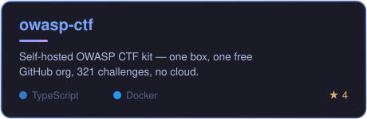
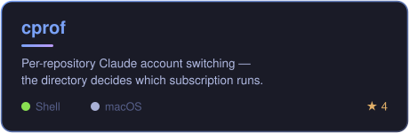
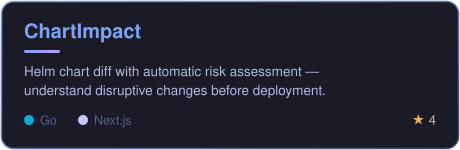
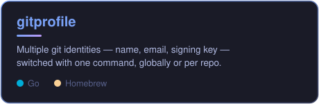
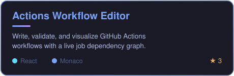
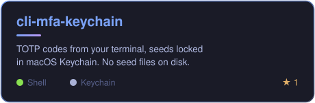

I build tools that make infrastructure and security work **visible and safe** — from Helm upgrade risk to hands-on security training, from CI/CD workflows to the credentials on your own machine.

I write about platform engineering, Kubernetes, and cloud security at **[dcotelo.dev](https://dcotelo.dev/blog/)** ([RSS](https://dcotelo.dev/rss.xml)).

---

## Featured Projects

🛡️ [owasp-ctf docs](https://dcotelo.github.io/owasp-ctf/) · 🗺️ [Actions live demo](https://dcotelo.github.io/actions) · **More tools:** [github-notifications-streamdeck](https://github.com/dcotelo/github-notifications-streamdeck) · [tf-version-reviewer](https://github.com/dcotelo/tf-version-reviewer) · [aws-secret-dbdriver](https://github.com/dcotelo/aws-secret-dbdriver)

---

## Stack

<b>Full stack details</b>

 

| Area | Technologies |
|------|-------------|
| **Languages** | Go, TypeScript, Bash, Python, PHP |
| **Cloud** | AWS (EKS, IAM, VPC, DynamoDB, Route53, KMS, S3, CDK, Secrets Manager) |
| **Kubernetes** | EKS, EKS Auto Mode, Karpenter, Helm, Kustomize |
| **GitOps / CI** | ArgoCD, GitHub Actions, OIDC-based auth |
| **IaC** | Terraform, Terraform Cloud, AWS CDK |
| **Frontend** | Next.js, React, Monaco Editor |
| **Observability** | Datadog, Grafana, SLOs |
| **Security** | IAM least privilege, CodeQL, OpenSSF Scorecard, OIDC |

---

## Focus

- **Kubernetes & AWS** — EKS (including Auto Mode & Karpenter), GitOps with ArgoCD and Helm
- **Cloud security** — IAM least privilege, OIDC-based CI/CD, secure-coding education through CTFs
- **Platform tooling** — Terraform modules and CI/CD patterns that reduce cognitive load
- **Reliability** — metrics, SLOs, and runbooks written for tired humans

---

 

**Building tools that make infrastructure visible, upgrades safe, and on-call less painful.**

